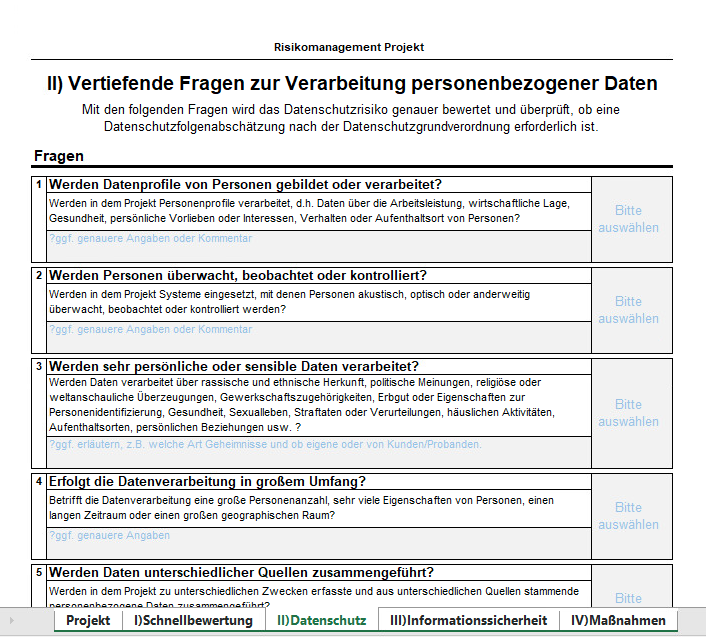

# How to get a project ID

**Note**: To [create a project](./../project-create/project-create.md) you require a project ID.

1. Carefully read the [Risk Management](https://support.itwm.fhg.de/Main/Risikomanagement%20Im%20Projekt) page (German only). 
2. Fill out the [Risk Assesstment](https://support.itwm.fhg.de/download/Main/Risikomanagement%20Im%20Projekt/ITWM-Risikobewertungsbogen-Projekte.xlsx?rev=1.1) form and send it to [informationssicherheit@itwm.fraunhofer.de](mailto:informationssicherheit@itwm.fraunhofer.de). An example of the form is given in Fig. 1. As you can see, you need to answer a five-page questionnaire.

    

    Fig. 1.

3. If any of your answers is `Yes` in the questionnaire, your may be subjected to a special audit with the STYX administration and the security team. Therefore, please **always include them in your security discussions**. We will NOT be able to change the STYX operation just to meet the security requirements of a single project! STYX cannot host any highly sensitive data!

4. If your assesstment is accepted, the ticket system will send you an email with your project ID.
