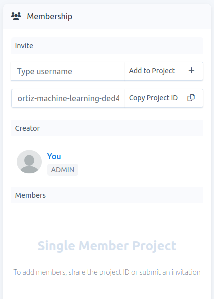
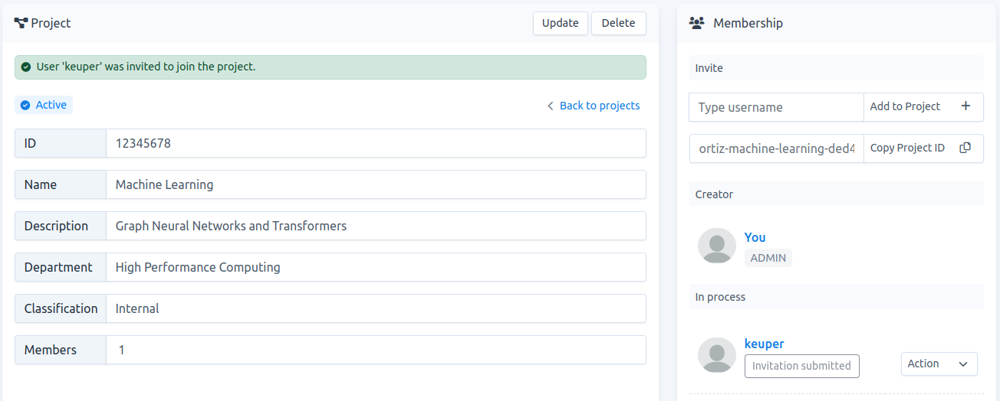

# How to invite users to join a project

**Note:** This option appears in the project-detail page and is only visible to `project-admins`. To access the project-detail page, go to `Projects`, then click on the project name of interest.

Two possibe scenarios:

- You share the `project-ID` and users use it to submit a request to join the project.
- Users share their `usernames` and you use them to send them an invitation to join the project.

## Share the project ID

With the `project-ID`,  users have access to the project-detail page. If the `project-ID` accidentally leaks out, there is no problem because the project-detail page shows a limited information to the public.

1.  In the project-detail page, click on `Copy Project ID` and share it, see Fig. 1.
    
    
    
    Fig. 1.
    
2.  With the `project-ID`, users can [submit a request](./../project-request/project-request.md) to join the project. Then you, as `project-admin` can either [accept](./../project-accept/project-accept-admin.md) or [reject](./../project-reject/project-reject-admin.md) this request.
    

## Send an invitation

1.  To add a user you have to know his/her `username`.
    
2.  In the project-detail page, type the `username` and click on `Add to Project`, see Fig. 1.
    
3.  If the `username` exists, the user will be added to `Membership` -> `In process`, see Fig. 2. In this example, user `keuper` was invited to the project. Now you, as `project-admin`, have to wait for the user to [accept](./../project-accept/project-accept-user.md) or [reject](./../project-reject/project-reject-user.md) the invitation.
    
    
    
    Fig. 2.
    
