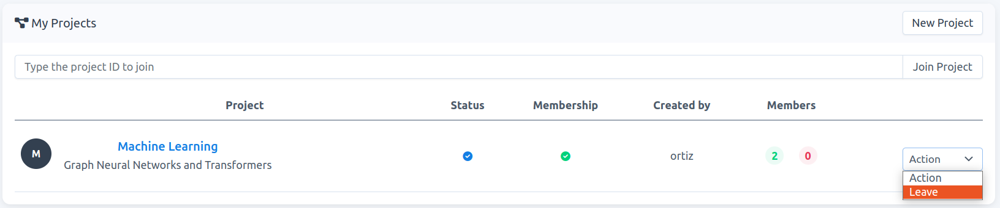
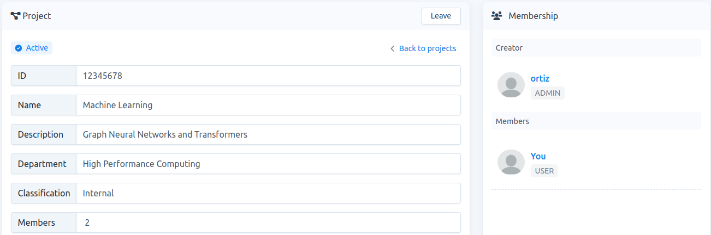
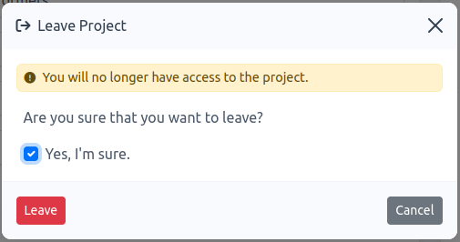

# How to leave a project

**Note:** If you are an `active member` of a project, i.e., your membership has been approved by the `carme-admin`, then you can leave the project at anytime. This does not apply to  `project-owners`. They cannot leave their projects; however, they can [delete](./../project-delete/project-delete.md) them. 

1. You can leave a project either in your project-list or in the project-detail page.

    ### project-list

    -  Go to `Projects`. Then click on `Action` -\> `Leave`, see Fig. 1. 

    

    Fig. 1. 

    ### project-detail

    - Go to `Projects`, then to acces the project-detail page, click on the project name of interest, e.g., `Machine Learning` in Fig. 1. On this new page, on the header click on `Leave`, see Fig. 2.

    

    Fig. 2. 

2.  Once you click on `Leave`, a modal form appears. You must confirm that you want to leave the project. Check `Yes, I'm sure` and click on `Leave`, see Fig. 3. The project is automatically removed from your project list.

    

    Fig. 3.
