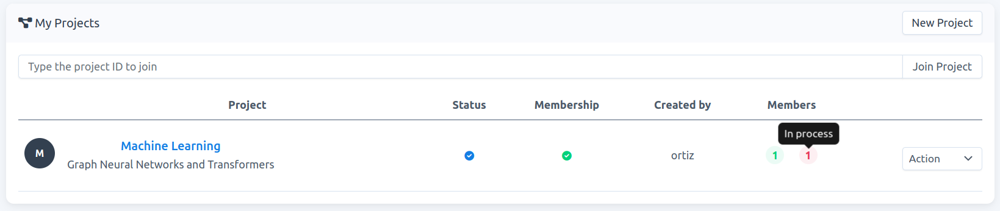
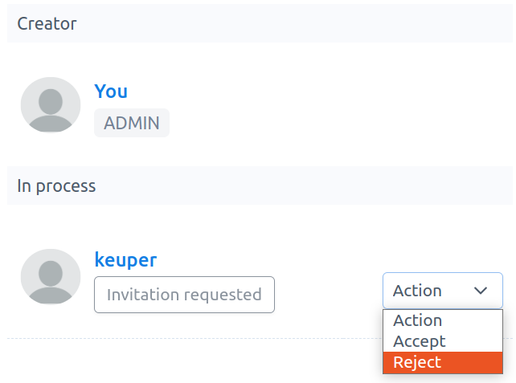
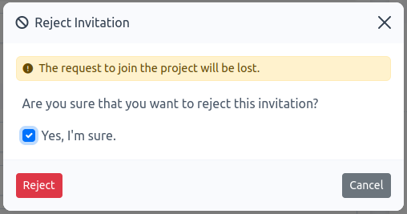

# How to reject a request to join a project

**Note**: When a user submits a request to join a project, you, as `project-admin`, can either `accept` or `reject` this request. Rejecting the request means that the project is removed from the user's project-list.

1.  Go to `Projects`, then click on the project name of interest to access its project detail page, e.g., `Machine Learning` in Fig. 1.
    
    
    
    Fig. 1.
    
2.  On this new page, the user will be listed on `Membership` -\> `In process`. To reject his/her request, click on `Action` -\> `Reject`, see Fig. 2.
    
    
    
    Fig. 2.
    
3.  Once rejected, a modal form appears. You must confirm that you want to reject this request. Check `Yes, I'm sure` and click on `Reject`, see Fig. 3. 
    

    
	
	Fig. 3.
