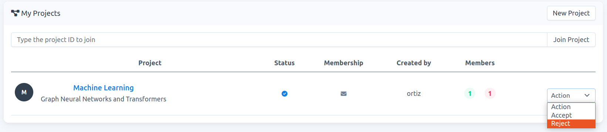
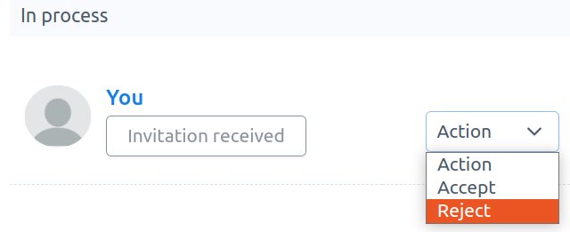
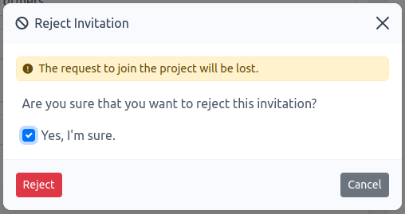

# How to reject an invitation to join a project

**Note**: When you receive an invitation to join a project, you can `accept` or `reject` this invitation. Rejecting the invitation means that the project is removed from your project-list. 

1. You can reject the invitation either in your project-list or in the project-detail page.

    ### project-list

    - Go to `Projects`. If you have received an invitation, the project would be visible in your project-list (if it is not there, **refresh your page**). To reject the invitation click on `Action` -\> `Reject`, see Fig. 1.
    
    
    
    ### project-detail

    -  Go to `Projects`, then to access the project-detail page click on the project name of interest, e.g., `Machine Learning` in Fig. 1. On this new page, you will be listed on `Membership` -> `In process`. You can reject the invitation by clicking on `Action` -\> `Reject`, see Fig. 2.
    
    
    
    Fig. 2.
    
2.  Once rejected, a modal form appears. You must confirm that you want to reject the invitation. Check `Yes, I'm sure` and click on `Reject`, see Fig. 3.
    
    
    
    Fig. 3.
    

