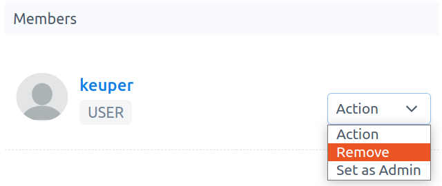
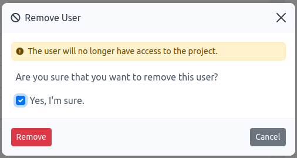

# How to remove a user from a project

**Note:** Only `active members` can be removed from a project. This option appears in the project-detail page and is only visible to `project-admins`. To access the project-detail page, go to `Projects`, then click on the project name of interest. 

1.  In the project-detail page, choose the user that you want remove, then click on `Action` -\> `Remove`, see Fig. 1.

    

    Fig. 1.

3.  A modal form appears. You must confirm that you want to remove the user from the project, check `Yes, I'm sure` and click on `Remove`.

    
  
    Fig. 2.
  
