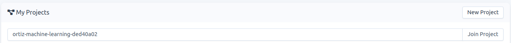
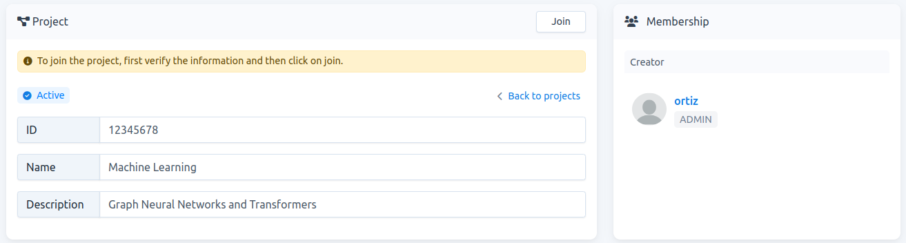
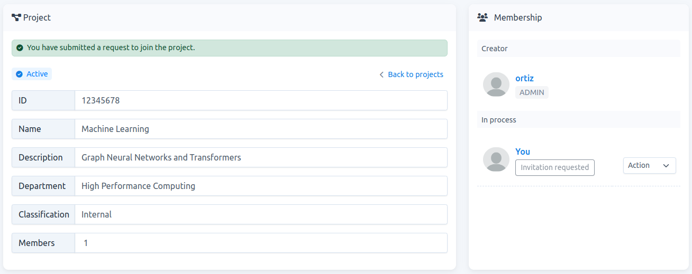

# How to submit a request to join a project

**Note**: To submit a request, a member of the project should send you via a private channel the `project-slug`.

1.  Go to `Projects` and type the `project-slug` in the given field . Then click on `Join Project`, see Fig. 1.
    
    
    
    Fig. 1.
    
2.  This gives you access to the project-detail page. However, because you are neither a member nor an invited user, the information given is limited. If this is the right project, on the header click on `Join` to confirm the request, see Fig. 2.
    
    
    
    Fig. 2.
    
3.  By submitting the request, additional information is granted. As you can see in Fig. 3, now you are listed in `Membership` -> `In process`, and your status is `Invitation requested`.
    

    
	
	Fig. 3.

4. You have to wait for the `project-admin`  to accept your request to join. Once you are accepted, your status becomes: `Waiting for approval`. This is because the carme administrator also needs to approve it. 

5. Once the carme administrator approves your request, you receive an email saying that you are now an `active member` of the project. You can now create jobs using the resources allocated to the project template.

    
