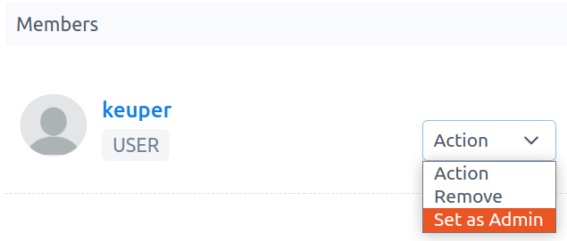
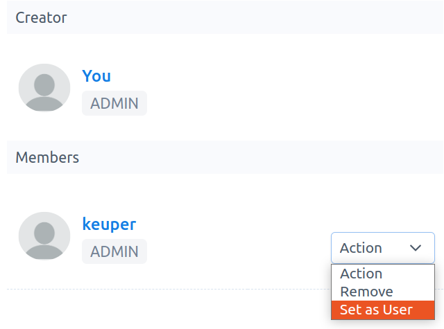

# How to set a user as project-admin

**Note:** This option appears in the project-detail page and is only visible to `project-admins`. Only `active members` can become `project-admins`. 

1. Go to `Projects`. You have access to the project-detail page by clicking on the project name of interest.

2.  In your project-detail page, choose the user that you want to set as `project-admin`. Then click on `Àction` -\> `Set as Admin`, see Fig. 1.

    

    Fig. 1.

3.  In this example, user `keuper` was set as `Admin`. To unset this click on `Action` -\> `Set as User`, see Fig. 2.

    

    Fig. 2
