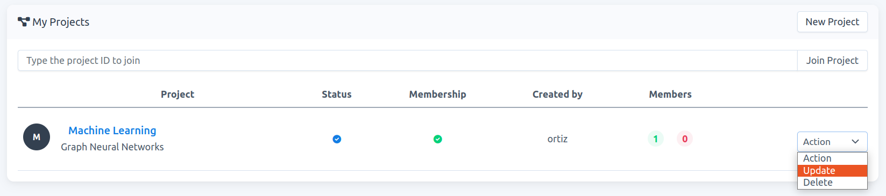
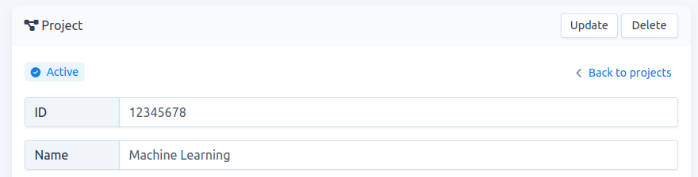
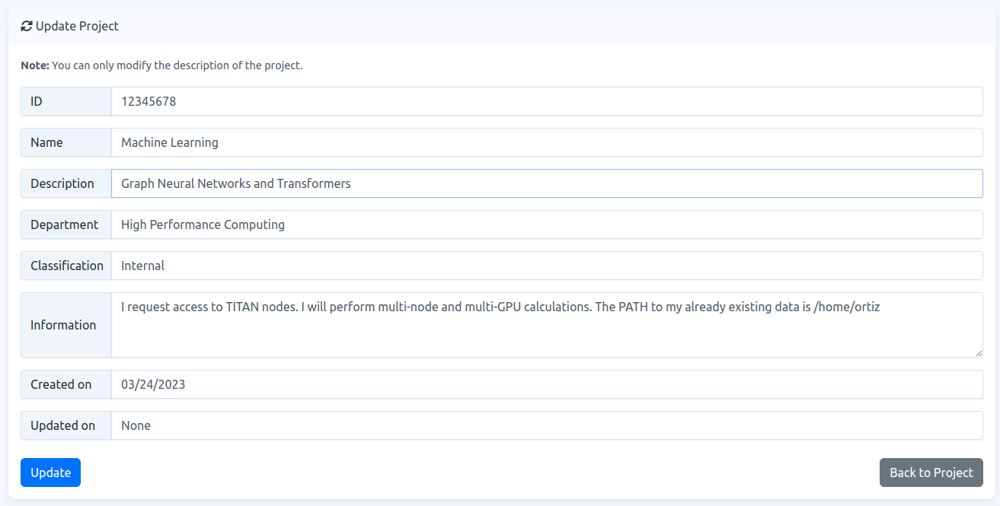
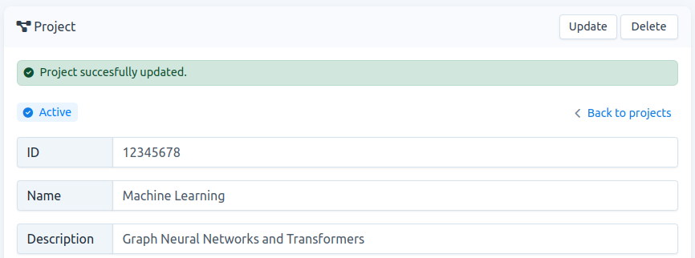

# How to update a project

**Note:** You can only modify the description of a project. Only `project-owners` and `project-admins` can update the project. Refer to ["How to set a user as project-admin"](./../project-set-admin/project-set-admin.md) for further details.

1. There are two possible ways to access your project-update page.

   - **project-list**: Go to `Projects`. In your list, click on `Action` -\> `Update`.
    
    
    
    Fig. 1.
    
    - **project-detail**: Go to `Projects`. You have access to the project-detail page by clicking on the project name, e.g., `Machine Learning` in Fig. 1. There, on the header click on `Update`, see Fig. 2.
    
    
    
    Fig. 2.
    
2.  In your project-update page you can change the `description` field. Once this is done click on `Update`, e.g., in Fig. 3, the project description now reads `Graph Neural Networks and Transformers`.
    
    
    
     Fig. 3.

3.  If your project description is successfully updated, your page will look like Fig. 4.
    
    
	
    Fig. 4.
    
4.  If you want to modify another field, contact the `carme-admin`. However, if your project is still `Waiting for approval`, it will be much easier to [delete your project](../project-delete/project-delete.md) and create it again.
