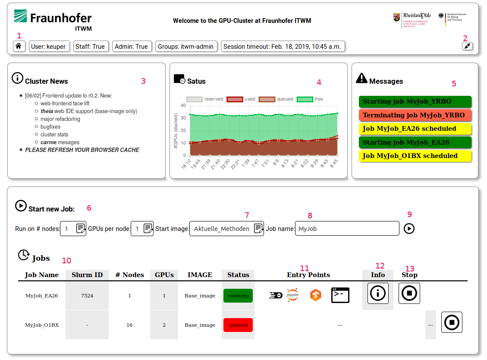
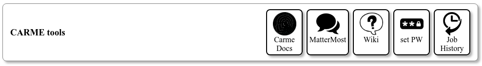

# *Carme* User Documentation 

## Overview
### What is *Carme* ?
[***Carme***](www.open-carme.org) an open source frame work to mange resources for multiple users running interactive jobs (e.g. Jupyter notebooks) on a Cluster of (GPU) compute nodes.

### Key features for users
* interactive GUI job on (GPU) clusters
* multi-user resource management 
* automatic data I/O
* usage of pre-build software images for machnie learning and data science
* creation and management of own images
* running large multi-node multi-GPU jobs in an desktop-like environment (full abstraction of the underlying HPC stack)

### NOTES
* This document is a generic *Carme* ducumentation. All images show the reference system at ITWM - individual *Carme* installations might vary in apperance and functionality. Please also refer to the local documentation.  

* *Carme* is under constant development, so is this documentation. Currently, this documentation refers to ***Carme r0.2***

### Basic Usage
After logging into a *Carme* system, users will see the following basic home screen 

1. **Status bar**: shows user details and session time-out
2. **Log out**
3. **System News**: maintenance and feature announcements 
4. **Cluster utilization**: graph showing the current and past availability of resources 
5. **Messages**: *Carme* status messages (e.g. starting/stopping jobs)
6. **Start new job**: select (selection is restricted by user profile)
    * num of nodes 
    * num of GPUs per node
7. **Job image** selection
8. **Job name** (optional)
9. **Start job** button
10. **Running jobs**: list of queued and running jobs
    * NOTE: depending on the availability of resources and user profile quotas, jobs might not start right away 
11. **Entry Points**: list services running in the job image, click to start
12. **Job Infos**: system Information on a running job
    * GPU / CPU / Memory assigned to job
    * GPU usage graph
    * GPU mem usage graph
13. **Stop Job**: manual termination of the job


Additionally, the home screen shows a ***Carme-Tools*** section with links to:
* This documentation
* The *Carme* group communication tool
* The local Wiki
* User Password management
* User job history
* Image management (restricted to some user groups)

### FAQs
see [List of FAQs](FAQ.md)

### Entry Points
see [Entry Point Doc](EntryPoints.md)

## Multi-Node Jobs
see [Multi Node Doc](Multi_Node_Jobs/readme.md)

## *Carme* APIs
### Python API
*Carme* provides a python library, which allows users to directly interact with the *Carme* system. To use it, simply

```
import carme

...

```

See the [auto generated API documentation](PythonAPI.md) for details. 

### Bash Scripts
* see [Bash Scripts](BashAPI.md)

## Creating and managing images
- coming soon -
