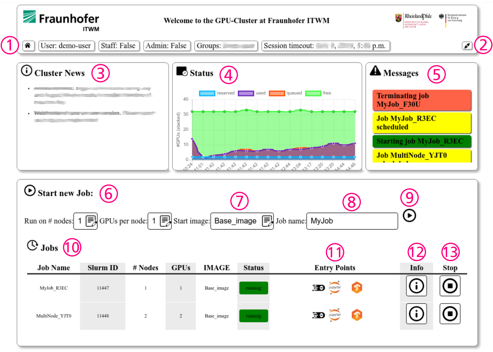

# *Carme* User Documentation 

## Overview
### What is *Carme* ?

### NOTE
This document is a generic *Carme* ducumentation. All images show the reference system at IWTM - individual *Carme* installations might vary in apperance and functionality. Please also refer to the local documentation.  

### Basic Usage
After logging into a *Carme* system, users will see the following basic home screen 

1. **Status bar**: shows user details and session time-out
2. **Log out**
3. **System News**: maintenance and feature announcements 
4. **Cluster utilization**: graph showing the current and past availibility of ressources 
5. **Messages**: *Carme* status messages (e.g. starting/stopping jobs)
6. **Start new job**: select (selection is restricted by user profile)
    * num of nodes 
    * num of GPUs per node
    * job image
    * job name (optional)

### FAQs
see [our currently updated list of FAQs](FAQ.md)

## How To ...
* [Use the *Jupyter* terminal](HowTo_Terminal.md)
* [Use the *Carme* environment variables](HowTo_Variables_and_Bashrc.md)
* [Use the *Carme* Python API](Carme_Python_API.md)
* [Add new Python Paths](HowTo_Paths.md)

### Multi-Node Jobs
see [Multi Node Doc](Multi_Node_Jobs/readme.md)
