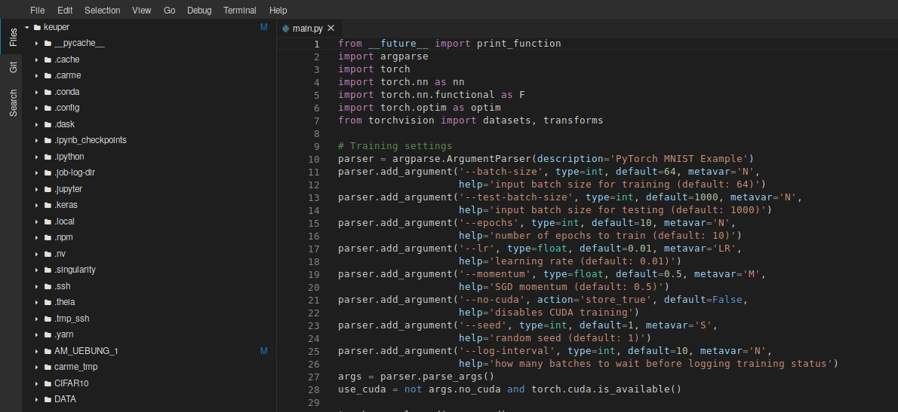

# *Carme* Entry Points
In *Carme*, so called *Entry Points* define web-services which are running inside a user container. 
By design, an *Entry Point* could be any service that communicates via ``https`` to the outside. 
* Advanced users and administrators can add new services inside containers and register them within *Carme*
* Hence, different images might provide different Entry Points

## Default Entry Points
By default, the *Carme* base-image provides the following *Entry Points*

* [Shell](#shell)
* [JupyterLab](#jupyter-lab) 
* [TensorBoard](#tensor-board)
* [Theia IDE](#theia)

## Shell
Both `Theia IDE` and `JupyterLab` provide access to shells. These shells are both so-called web-shells that are based on [xterm.js](https://github.com/xtermjs/xterm.js/) the same tool that is used in e.g. VS Code.  
These shells can be used as you would use and regular terminal in any Linux distribution and you can work as if you have logged in the respective compute node via `ssh`. If you want to figure out more about what you can to with the terminal you should have a look at the [Howto on working with the terminal](HowTo_Terminal.md) section.

## Theia IDE

[Theia IDE](https://www.theia-ide.org/) is web-IDE that _"embraces many of the design decisions and even directly supports VS Code extensions"_. Besides this you get
* a file browser
* integrated terminal
* text editor with syntax highlighting and code completion
* web-terminal
* support for many VS Code extensions

Even though `Theia` is a really powerful IDE it is intended for users that prefer working with the terminal and run their respective scripts directly and not via Jupyter Notebooks.

## JupyterLab

[JupyterLab](https://jupyterlab.readthedocs.io/en/stable/) is another web-IDE with support for
* supports interactive *Jupyter Notebooks*
* integrated terminal
* text editor with syntax highlighting and code completion
* file browser
* data visualization

## Tensor Board
Carme provides regarding infrastructure everything that is needed to use TensorBoard inside your job.
